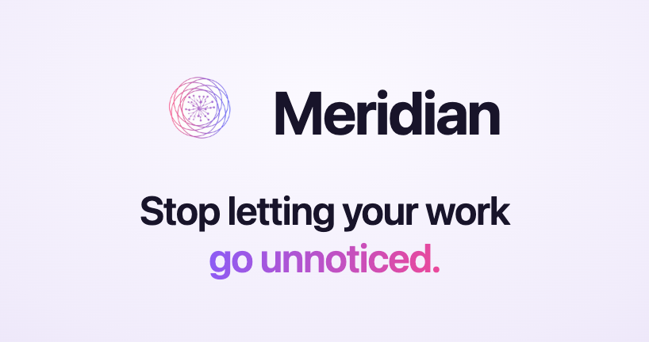
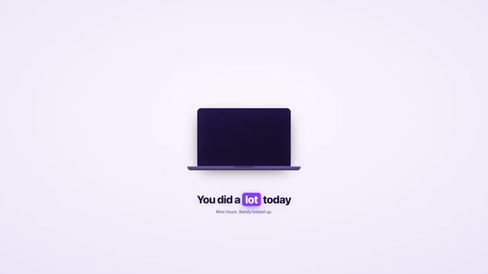
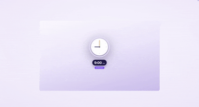

<h1 align="center">
  <a href="https://meridiona.com/?ref=github-readme#download">DOWNLOAD MERIDIAN</a>
</h1>

 

## Watch the Demo

See how Meridian turns a day of screen activity into a timeline, a daily summary, and updated tickets, without anything typed in by hand.

  

## Reconstruct Any Day

Meridian rebuilds your day from what actually happened on screen, so you can scrub back through it like a recording instead of trying to remember.

  

