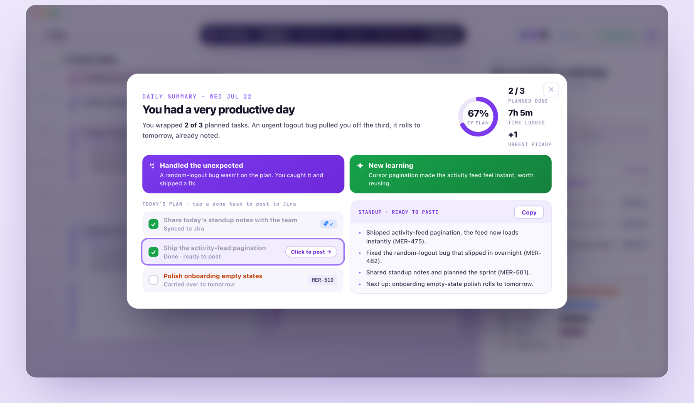
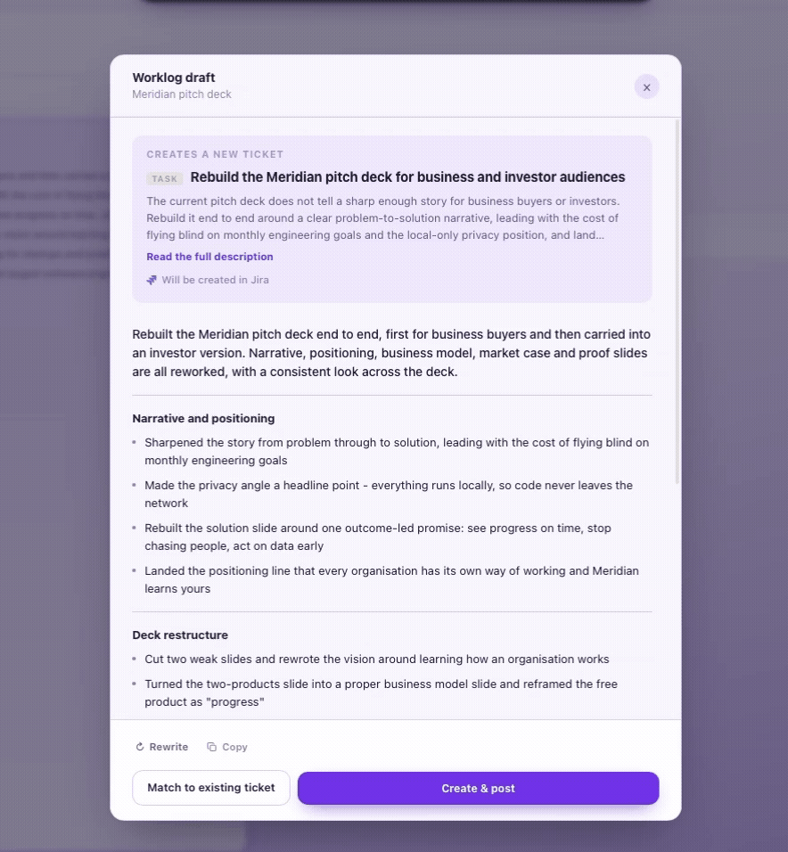

  

 

## Watch the Demo

See how Meridian turns a day of screen activity into a timeline, a daily summary, and updated tickets, without anything typed in by hand.

<video src="https://github.com/user-attachments/assets/2ac97a47-c08f-4905-87e7-201b42c08e4b" width="960" controls></video>

## Reconstruct Any Day

Meridian rebuilds your day from what actually happened on screen, so you can scrub back through it like a recording instead of trying to remember.

  

## Your Day, Summarised

At the end of the day, Meridian tells you what you actually got done, what pulled you off plan, and hands you a standup already written and ready to paste into Jira.

  

## Drafts, Never Surprises

Meridian writes the ticket update in your own words, from what you actually did, then waits. Rewrite it, match it to an existing ticket, or post it as is, nothing goes to Jira until you hit the button.

  

